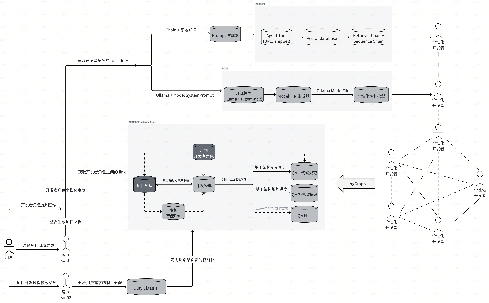

**本仓库是南开大学软件学院2024年中软国际暑期实训的代码仓库**

欢迎交流分享经验，引用参考任意仓库内容请先与我们沟通，抵制抄袭行为

@copyright

通过 Github 或者邮箱 2211992@mail.nankai.edu.cn 与我们联系

## 项目名称

中软国际-基于 LangChain 技术的 LLM 智能客服系统实战项目



## 成员介绍

第十三组项目成员：邝伟华、王璞、余文祥、钱程

* 项目经理（PM）邝伟华
* 开发经理（TTL）王璞
* 代码规范（QA）余文祥
* 日志维护（QA）钱程
* **开发测试 （Dev&Test）全体成员**

## 开发日志

### from 20240715 to 20240809

1. 项目名称：MAS4SE Multi-Agent System for Software Engineering
2. 项目简介：LangGraph框架搭建的可视化多智能体工作流系统，LangChain+Ollama
3. 确保你的本地已配置：
   - Python 3.9 + LangChain + LangGraph
   - Node.js + Vue3
   - Ollama
   - Redis


#### **使用流程**

1. 保存仓库至本地

   ```
   git clone https://github.com/waywooKwong/CSI-LangChain-LLM-Chatbot.git
   ```
2. 前端启动

   ```
   cd MAS4SE-frontend
   npm run serve
   ```
3. 后端启动

   ```
   cd MAS4SE-backend
   python run.py
   ```
4. 数据库启动

   ```
   cd MAS4SE-frontend/src/database
   cd Redis redis-server.exe
   node server.cjs
   ```

注意：

1. embedding_models 编码模型 m3e-base 需要本地配置

```
MAS4SE-backend/src/embedding_models/m3e-base
```

2. 前后端交互

```
前端 JointUI 向后端传递连接结点关系
MAS4SE-backend/frontend_json_process/json_simplified
工作流运行完成后生成的文本
MessageSum
```

### from 20240701 to 20240707

1. 第一周实训内容：**遵循软件开发完整流程实现一个具有完整前后端功能的完整小项目**
2. 项目名称：CSI-ATM
3. 项目简介：简易的ATM系统，分为用户端和管理员端。

   用户服务实现用户存款、转账与取款功能，管理员服务实现管理员登录与操作流水日志查询
4. 确保你的本地已配置：

   - VScode
   - Node.js
   - MySQL Workbench
