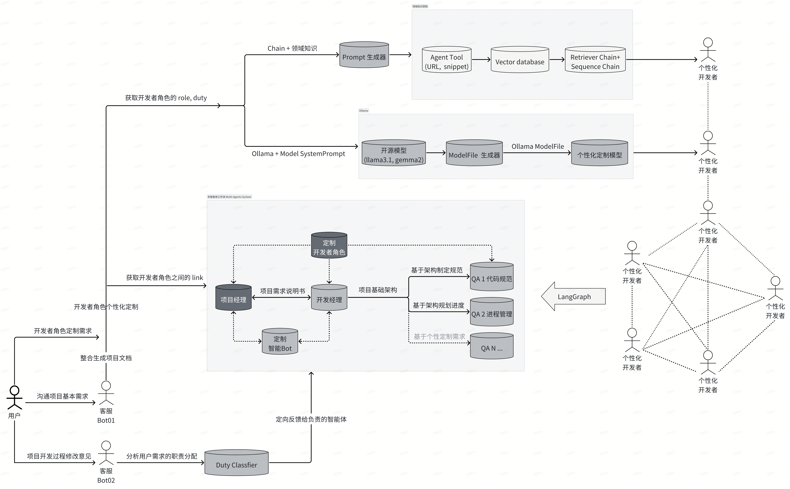
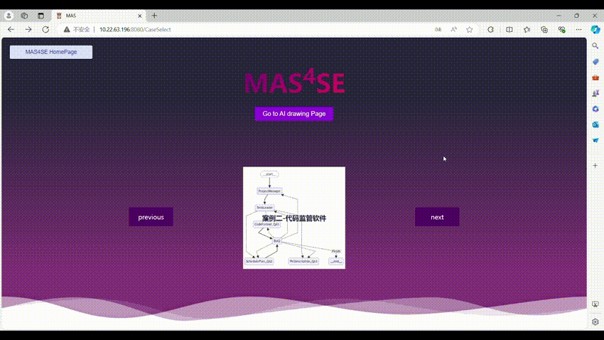
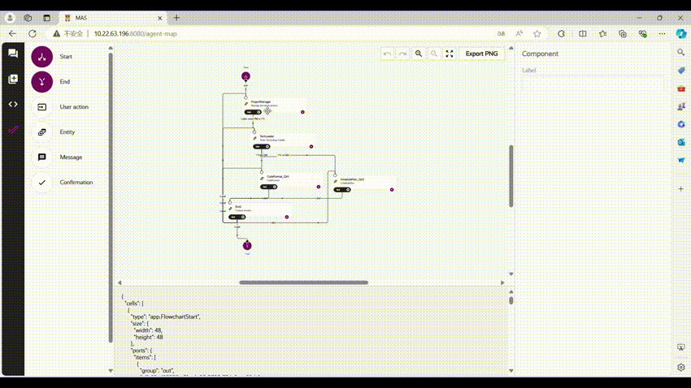
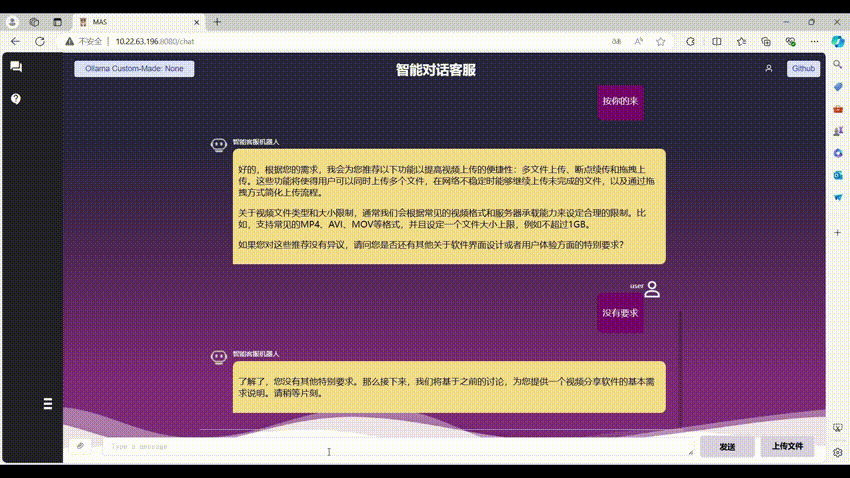
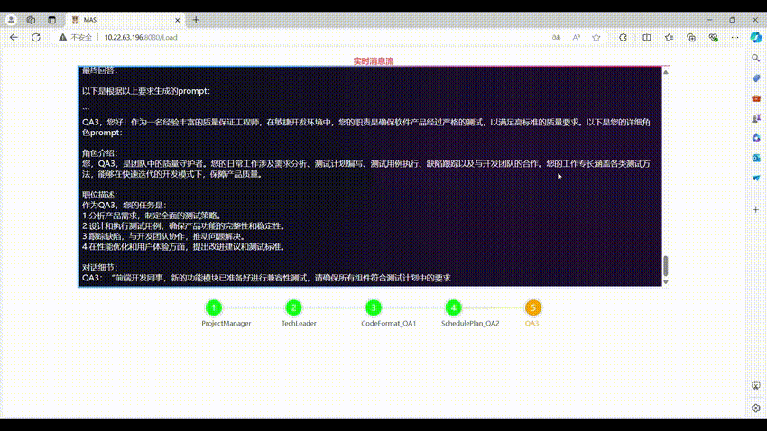
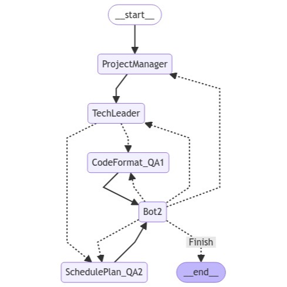
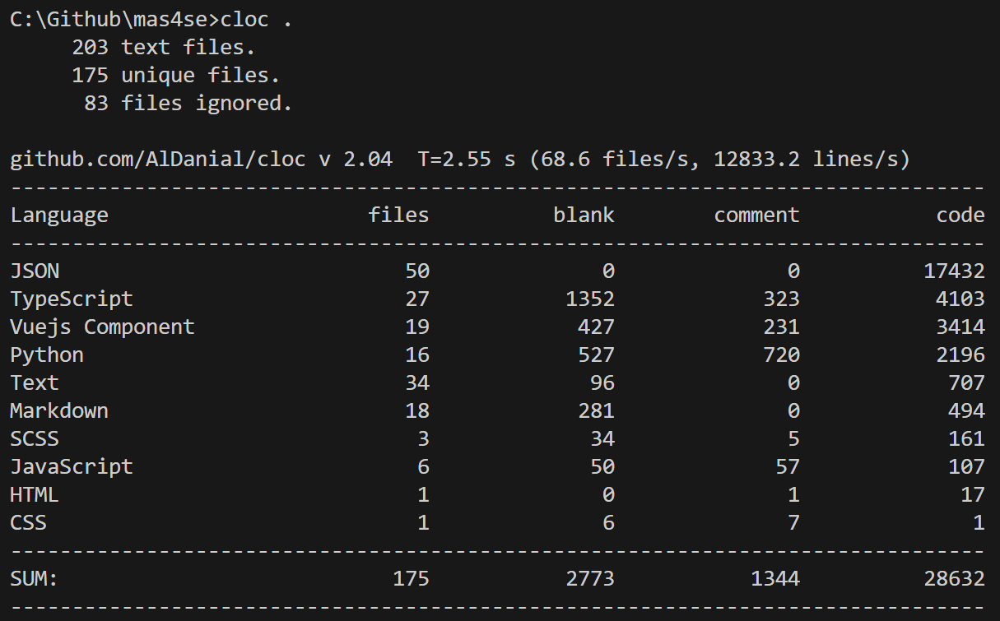

## News

new generation from 15/03/2025,

mainly based on stable version of LangGraph & LangChain, ensembling MCP from Anthropic and Browser use.

more info refer to new project repo: [AdGraph](https://github.com/waywooKwong/aigc-AdGraph)

## Project

**Multi-Agent System Workflow for Software Engineering**

In software development scenarios, multiple roles—such as project managers, tech leads, and QA engineers—collaborate to deliver a project demo that meets customer requirements. By building role-specific agents powered by domain expertise, we can significantly reduce development costs and streamline the process. To this end, we propose  **MAS4SE (Multi-Agent System for Software Engineering)** , a platform built upon the open-source LLM framework **LangChain** and the multi-agent orchestration framework  **LangGraph** .



## Demo

1. Historical cases showcase
   
2. Agent customized by User, Workflow UI like Coze
   
3. Chat with Service Bot
   
4. Collaboration process of Agents
   

## How to run

Please ensure you have the following environments :

- Python 3.9 + LangChain + LangGraph
- Node.js + Vue3
- Ollama
- Redis



1. Clone this repo

   ```
   git clone https://github.com/waywooKwong/CSI-LangChain-LLM-Chatbot.git
   ```
2. run Web UI

   ```
   cd MAS4SE-frontend
   npm run serve
   ```
3. run backend function server

   ```
   cd MAS4SE-backend
   python run.py
   ```
4. run database server

   ```
   cd MAS4SE-frontend/src/database
   cd Redis redis-server.exe
   node server.cjs
   ```

Attention：

1. embedding_models:  m3e-base needs to be downloaded local.

```
MAS4SE-backend/src/embedding_models/m3e-base
```

2. Interaction between frontend & backend

```
前端 JointUI 向后端传递连接结点关系
MAS4SE-backend/frontend_json_process/json_simplified
工作流运行完成后生成的文本
MessageSum
```

## Developers

Origin version: Weihua Kuang (邝伟华)、Pu Wang (王璞)、Cheng Qian (钱程)、Wenxiang Yu (余文祥)

This repository is maintained by Weihua Kuang (@**waywooKwong**).

### Codes summary
图片中展示的是精简后只保留核心功能代码的工作量，但要注意，仓库中保存的历史v1版本是完整原始开发的代码。
包含冒烟测试代码以及预学习的模型组件代码，实际的工作量（指Python）部分应当是当前的 2-3 倍。



## Thanks

We use JointJS+ to implement the interactive workflow part of Web UI.

https://www.jointjs.com/demos/chatbot

## Contact us

Push issues under this repo, or eamil Weihua Kuang by weihua.kwong@mail.nankai.edu.cn
